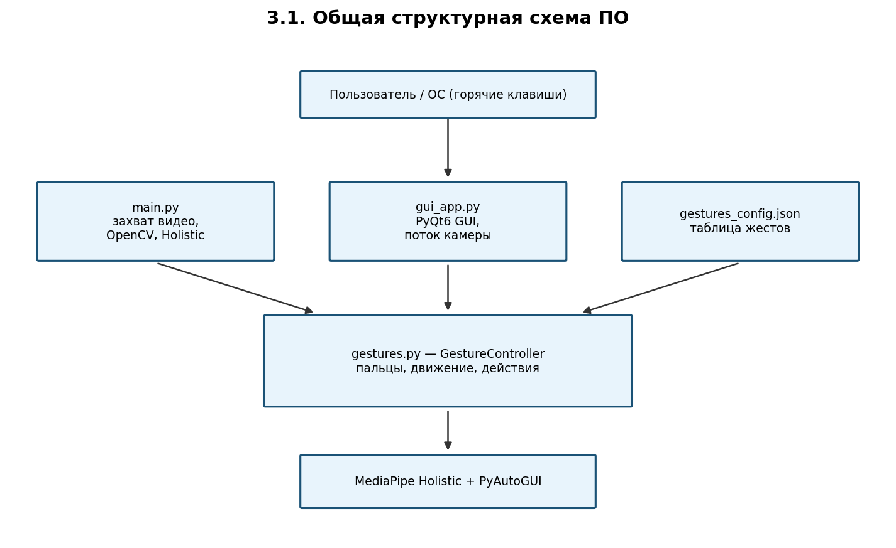
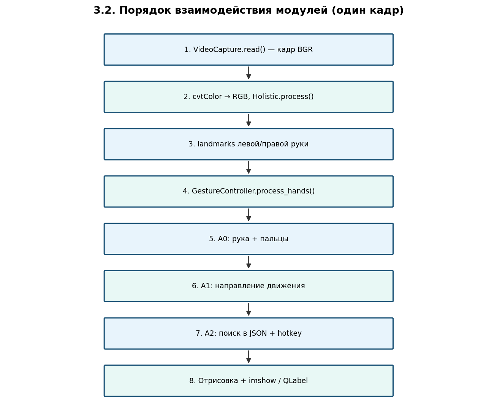
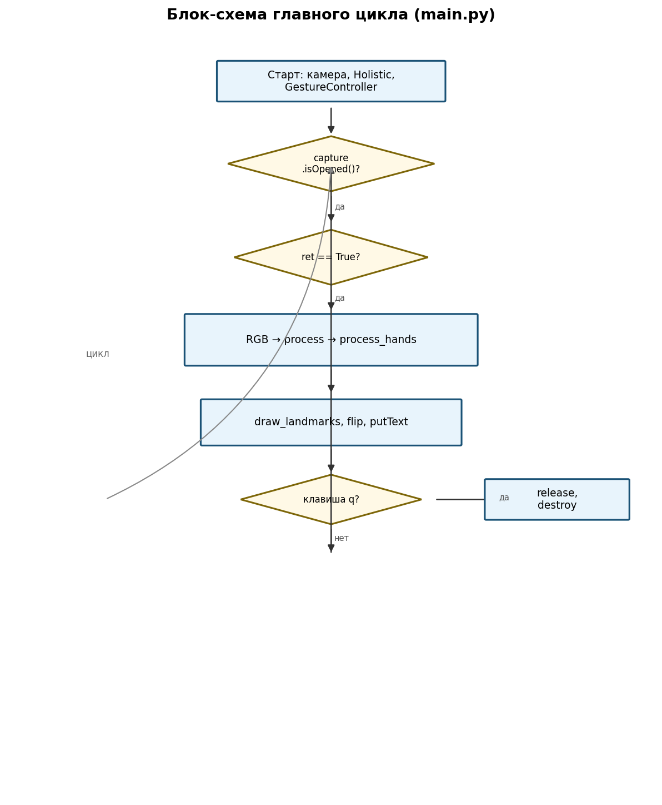
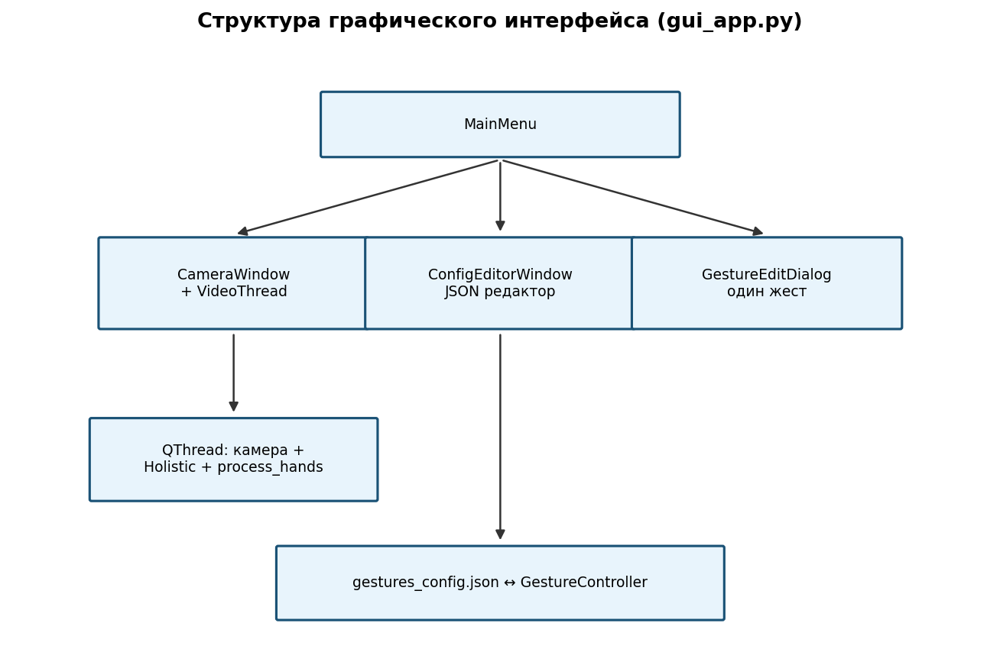
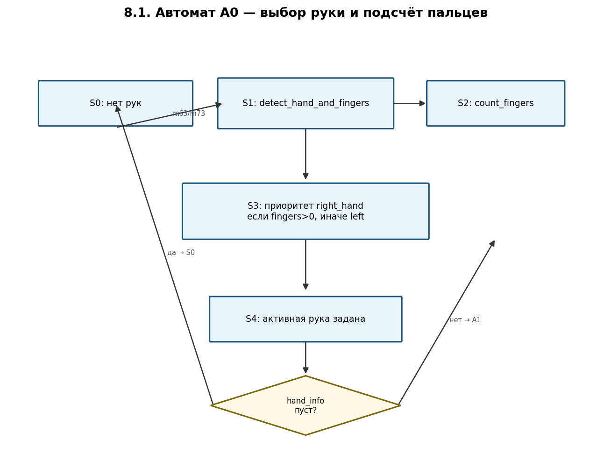
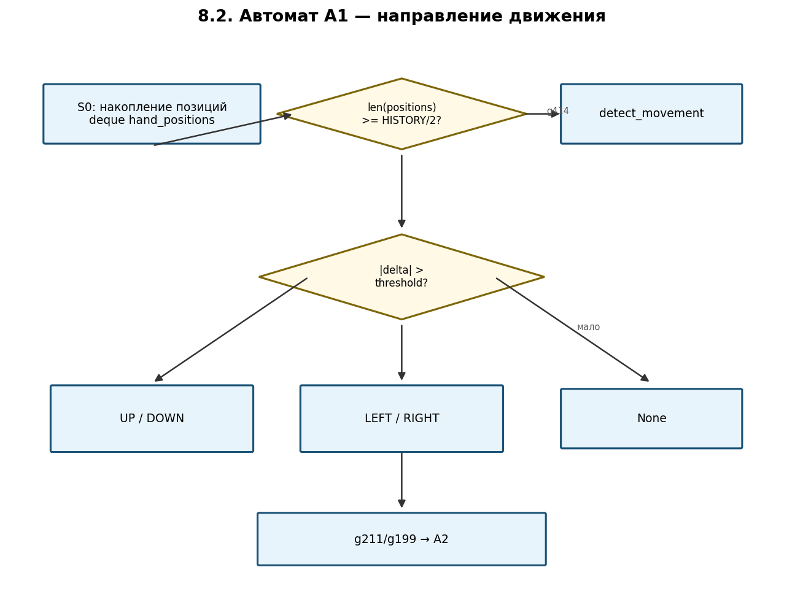
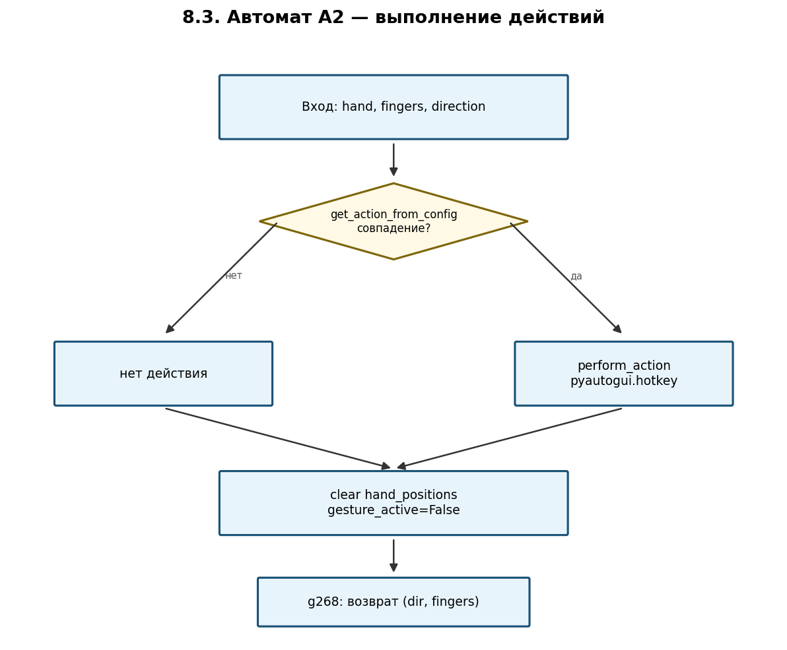
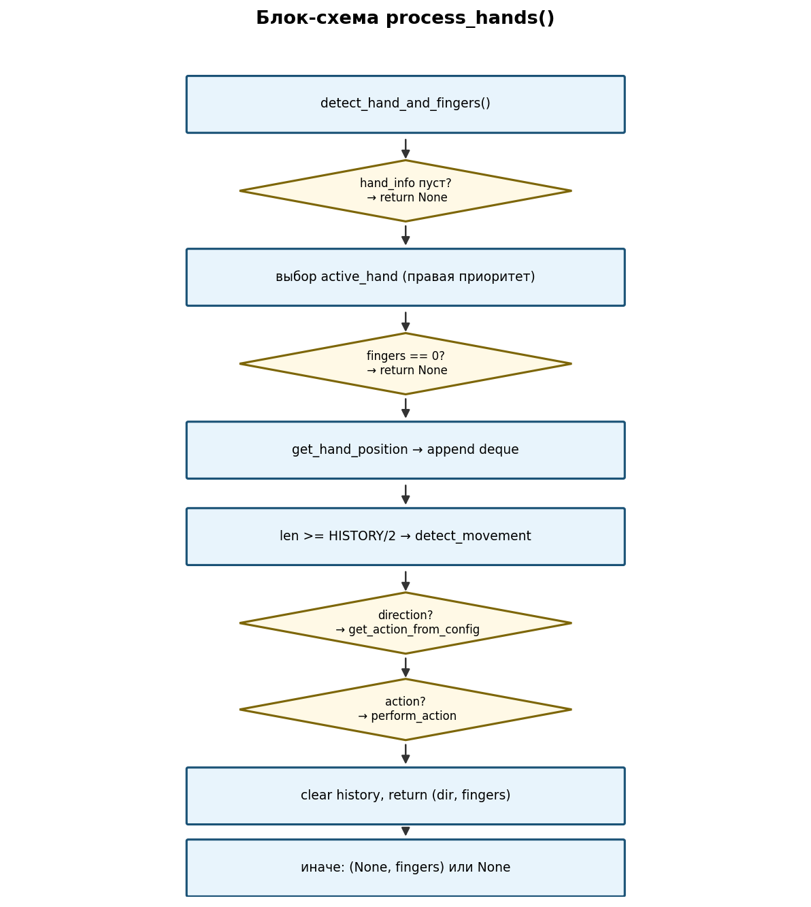

# СИСТЕМА УПРАВЛЕНИЯ КОМПЬЮТЕРОМ С ПОМОЩЬЮ ЖЕСТОВ РУК

## ПРОГРАММНАЯ ДОКУМЕНТАЦИЯ

**Используемые технологии:** Python 3.12+, OpenCV, MediaPipe Holistic, PyAutoGUI, PyQt6, JSON  
**Состав разработки:** модуль консольного видеопотока (`main.py`), модуль распознавания (`gestures.py`), графический интерфейс (`gui_app.py`), конфигурация жестов (`gestures_config.json`).

---

## ОГЛАВЛЕНИЕ

1. [Введение](#1-введение)
2. [Частное техническое задание](#2-частное-техническое-задание-на-подсистему-распознавания-жестов)
3. [Структурная схема программного обеспечения](#3-структурная-схема-программного-обеспечения)
4. [Перечень и нумерация событий](#4-перечень-и-нумерация-событий)
5. [Перечень и нумерация входных переменных](#5-перечень-и-нумерация-входных-переменных)
6. [Перечень и нумерация выходных воздействий](#6-перечень-и-нумерация-выходных-воздействий)
7. [Пояснения к используемой нотации](#7-пояснения-к-используемой-нотации)
8. [Системозависимая часть (автоматы A0–A2)](#8-системозависимая-часть)
9. [Исходные тексты системозависимой части](#9-исходные-тексты-системозависимой-части)
10. [Протоколы функционирования](#10-протоколы-функционирования)
11. [Требования к программному обеспечению](#11-требования-к-программному-обеспечению)
12. [Требования к программной документации](#12-требования-к-программной-документации)
13. [Технико-экономические показатели](#13-технико-экономические-показатели)
14. [Стадии и этапы разработки](#14-стадии-и-этапы-разработки)
15. [Порядок контроля и приёмки](#15-порядок-контроля-и-приёмки)
16. [Установка и эксплуатация](#16-установка-и-эксплуатация)
17. [Каталог блок-схем](#17-каталог-блок-схем)

---

## 1. ВВЕДЕНИЕ

Настоящий документ описывает программный комплекс **«Система управления компьютером с помощью жестов рук»**. Назначение системы — бесконтактное управление рабочей станцией через веб-камеру: пользователь показывает одну или две руки, программа определяет число поднятых пальцев и направление движения ладони, после чего эмулирует сочетания клавиш или медиаклавиши средствами **PyAutoGUI**.

Документация оформлена в духе курсового проектирования с применением **автоматного подхода (SWITCH-технология)**: логика распознавания разбита на три координирующих автомата **A0**, **A1**, **A2**, реализованных методами класса `GestureController`.

### 1.1. Состав поставки

| Компонент | Файл | Назначение |
|-----------|------|------------|
| Точка входа (консоль) | `main.py` | Захват с камеры, отображение OpenCV |
| Точка входа (GUI) | `gui_app.py` | Меню, камера в окне, редактор конфигурации |
| Ядро распознавания | `gestures.py` | Класс `GestureController` |
| Конфигурация | `gestures_config.json` | Таблица «жест → действие» |
| Зависимости | `requirements.txt` | Версии библиотек |
| Документация | `doc/` | Настоящий файл и PNG-схемы |

### 1.2. Режимы запуска

- **Консольный:** `python main.py` — окно «Gesture Control», выход клавишей `q`.
- **Графический:** `python gui_app.py` — главное меню, отслеживание и редактор жестов.

---

## 2. ЧАСТНОЕ ТЕХНИЧЕСКОЕ ЗАДАНИЕ НА ПОДСИСТЕМУ РАСПОЗНАВАНИЯ ЖЕСТОВ

### 2.1. Назначение подсистемы

Подсистема распознавания жестов обеспечивает:

1. Захват видео с веб-камеры в реальном времени (индекс устройства `0`).
2. Обнаружение и отслеживание 21 ключевой точки на каждой кисти (**MediaPipe Holistic**, режим рук).
3. Подсчёт поднятых пальцев (0–5) с учётом ориентации ладони (большой палец — по оси X).
4. Определение направления движения ладони: **UP**, **DOWN**, **LEFT**, **RIGHT**.
5. Сопоставление тройки `(рука, пальцы, направление)` с записью в `gestures_config.json`.
6. Выполнение действия через `pyautogui.hotkey(...)`.
7. Визуальную обратную связь (наложение скелета руки, текст состояния).

### 2.2. Функциональные требования

#### 2.2.1. Обнаружение рук

- Одновременно обрабатываются до двух рук: `right_hand_landmarks`, `left_hand_landmarks`.
- Пороги детекции Holistic: `min_detection_confidence=0.5`, `min_tracking_confidence=0.5`.

#### 2.2.2. Подсчёт пальцев

- Для каждой обнаруженной руки вызывается `count_fingers(hand_landmarks)`.
- Индексы MediaPipe: кончики `[4,8,12,16,20]`, суставы `[3,6,10,14,18]`.
- Большой палец: сравнение `landmark[4].x` и `landmark[3].x` с учётом признака `is_right_hand` (запястье vs основание среднего пальца).
- Остальные пальцы: палец «поднят», если `tip.y < pip.y` (нормализованные координаты кадра).

#### 2.2.3. Определение движения

- Активная рука: **правая**, если на ней `fingers > 0`; иначе **левая** при `fingers > 0`.
- Позиция ладони: среднее между запястьем (0) и MCP среднего пальца (9).
- История: `collections.deque`, длина по умолчанию `history_length=20`.
- Анализ движения начинается при `len(hand_positions) >= HISTORY_LENGTH // 2` (10 кадров при defaults).
- Порог по умолчанию: `movement_threshold=80` (пиксели после масштабирования `* 1000`).
- Горизонтальное направление инвертируется для левой/правой руки (зеркальное отображение кадра учтено в `main`/`gui` через `cv2.flip`).

#### 2.2.4. Сопоставление с действием

- Линейный поиск по массиву JSON-объектов.
- Поля записи: `hand`, `fingers`, `direction`, `action` (массив строк для `hotkey`).

#### 2.2.5. Интерфейс пользователя

- **main.py:** подписи `Gesture`, `Fingers`, `Gesture: ACTIVE/INACTIVE`, разметка рук (синяя/красная).
- **gui_app.py:** `QLabel` с направлением, пальцами и статусом; редактор списка жестов.

### 2.3. Требования к производительности

| Показатель | Значение |
|------------|----------|
| Частота обработки | ≥ 15 FPS (типично 25–30 на CPU) |
| Задержка жест → действие | ≤ 0,3 с при накопленной истории |
| Разрешение | 640×480 и выше (зависит от камеры) |

### 2.4. Требования к конфигурированию

Формат записи в `gestures_config.json`:

```json
{
  "hand": "right_hand",
  "fingers": 4,
  "direction": "LEFT",
  "action": ["prevtrack"]
}
```

- `hand`: `"left_hand"` | `"right_hand"`
- `fingers`: целое 1–5 (в конфиге; 0 не используется для активной руки)
- `direction`: `"UP"` | `"DOWN"` | `"LEFT"` | `"RIGHT"`
- `action`: массив имён клавиш PyAutoGUI (см. приложение А)

Редактирование без перекомпиляции: вручную, через GUI (`ConfigEditorWindow`) или внешним редактором.

### 2.5. Предустановленные жесты (текущая конфигурация)

| Рука | Пальцы | Направление | Действие |
|------|--------|-------------|----------|
| left_hand | 3 | DOWN | win, d |
| left_hand | 3 | UP | win, d |
| left_hand | 2 | RIGHT | alt, shift, tab |
| left_hand | 2 | LEFT | alt, tab |
| right_hand | 5 | DOWN | volumedown |
| right_hand | 5 | UP | volumeup |
| right_hand | 5 | RIGHT | volumeup |
| right_hand | 4 | RIGHT | nexttrack |
| right_hand | 4 | LEFT | prevtrack |
| right_hand | 4 | UP | playpause |
| right_hand | 4 | DOWN | pause |

---

## 3. СТРУКТУРНАЯ СХЕМА ПРОГРАММНОГО ОБЕСПЕЧЕНИЯ

### 3.1. Общая структурная схема



**Модули:**

| Модуль | Ответственность |
|--------|-----------------|
| `main.py` | `VideoCapture`, цикл кадров, Holistic, отрисовка, вызов `process_hands` |
| `gui_app.py` | PyQt6: меню, поток `VideoThread`, редактор JSON |
| `gestures.py` | `GestureController`: A0–A2, загрузка конфига |
| `gestures_config.json` | Внешняя таблица соответствий |

### 3.2. Порядок взаимодействия модулей (один кадр)



1. `capture.read()` → кадр BGR.
2. Преобразование в RGB, `holistic_model.process(image)`.
3. Передача `right_hand_landmarks`, `left_hand_landmarks` в `process_hands`.
4. Внутри контроллера: **A0** → **A1** → **A2** (при выполнении условий).
5. Отрисовка landmarks, `flip`, текст, `imshow` / сигнал в GUI.

### 3.3. Блок-схема главного цикла



### 3.4. Архитектура GUI



Классы: `MainMenu`, `CameraWindow`, `VideoThread`, `ConfigEditorWindow`, `GestureEditDialog`.

---

## 4. ПЕРЕЧЕНЬ И НУМЕРАЦИЯ СОБЫТИЙ

События генерируются главным циклом (каждый кадр) или внутренней логикой автоматов.

| Номер | Обозначение | Описание | Источник |
|-------|-------------|----------|----------|
| m18 | NEW_FRAME | Захвачен новый кадр | `capture.read()` |
| m63 | RIGHT_HAND | Обнаружена правая рука | `results.right_hand_landmarks` |
| m73 | LEFT_HAND | Обнаружена левая рука | `results.left_hand_landmarks` |
| g50 | FINGERS_CHANGED | Изменилось число пальцев на активной руке | сравнение `current_fingers_count` |
| g211u | MOVE_UP | Зафиксировано движение вверх | `detect_movement` → `"UP"` |
| g211d | MOVE_DOWN | Движение вниз | `"DOWN"` |
| g199l | MOVE_LEFT | Движение влево | `"LEFT"` |
| g199r | MOVE_RIGHT | Движение вправо | `"RIGHT"` |
| g414 | HISTORY_READY | Накоплена история ≥ HISTORY/2 | `len(hand_positions)` |
| g268 | ACTION_DONE | Выполнено действие из конфига | `perform_action` |
| m91 | KEY_Q | Нажата клавиша выхода | `waitKey` == `q` |

---

## 5. ПЕРЕЧЕНЬ И НУМЕРАЦИЯ ВХОДНЫХ ПЕРЕМЕННЫХ

| Номер | Обозначение | Тип | Описание |
|-------|-------------|-----|----------|
| g92r | right_hand_landmarks | NormalizedLandmarkList | Точки правой руки MediaPipe |
| g92l | left_hand_landmarks | NormalizedLandmarkList | Точки левой руки |
| g413 | MOVEMENT_THRESHOLD | int | Порог смещения (по умолчанию 80) |
| g415 | ACTION_COOLDOWN | float | Задержка между действиями (в конструкторе; в текущей версии **не используется** в `process_hands`) |
| g416 | HISTORY_LENGTH | int | Размер deque (20) |
| g41 | config_data | list[dict] | Загруженный JSON |
| g17 | config_file | str | Путь к файлу конфигурации |

---

## 6. ПЕРЕЧЕНЬ И НУМЕРАЦИЯ ВЫХОДНЫХ ВОЗДЕЙСТВИЙ

| Номер | Обозначение | Описание |
|-------|-------------|----------|
| m63 | show_hand_info | Текст `r: N f` / `l: N f` на кадре |
| m91 | show_fingers | `Fingers: N` |
| m89 | show_direction | `Gesture: UP/DOWN/...` |
| g268 | execute_action | `pyautogui.hotkey(*action)` |
| g92 | set_active_hand | `current_hand`, `gesture_active=True` |
| m90 | draw_landmarks | Отрисовка HAND_CONNECTIONS |
| s01 | gui_gesture_signal | `gesture_info_signal` в PyQt |

---

## 7. ПОЯСНЕНИЯ К ИСПОЛЬЗУЕМОЙ НОТАЦИИ

### 7.1. Нотация графов переходов

- **Состояния** — прямоугольники: устойчивые режимы обработки.
- **Условия** — ромбы: проверка данных кадра.
- **Дуги** — стрелки с метками событий (m*, g*).
- **Начальное состояние** — вход в функцию без накопленных данных.

### 7.2. Шаблон реализации автомата в коде

Автомат не выделен в отдельный класс; переходы реализованы **последовательными вызовами** в `process_hands` с ранним `return`:

```python
hand_info = self.detect_hand_and_fingers(...)   # A0
if not hand_info: return None
# выбор active_hand
current_position = self.get_hand_position(...)
self.hand_positions.append(current_position)
if len(self.hand_positions) >= self.HISTORY_LENGTH // 2:
    direction = self.detect_movement(...)       # A1
    action = self.get_action_from_config(...)   # A2
    if action: self.perform_action(action)
```

---

## 8. СИСТЕМОЗАВИСИМАЯ ЧАСТЬ

### 8.1. Автомат A0 — выбор активной руки и подсчёт пальцев

#### 8.1.1. Словесное описание

1. **S0:** рук в кадре нет → `gesture_active=False`, возврат `None`.
2. **S1:** вызов `detect_hand_and_fingers` — словарь `{right_hand: n, left_hand: m}`.
3. **S2:** для каждой руки `count_fingers`.
4. **S3:** если `right_hand` с `fingers>0` → активная `right_hand`; иначе если `left_hand` с `fingers>0` → `left_hand`; иначе S0.
5. **S4:** сохранение `current_hand`, `current_fingers_count`, отображение на кадре.

#### 8.1.2. Схема связей и граф переходов



#### 8.1.3. Реализующие функции

- `detect_hand_and_fingers(right, left)` → `dict | None`
- `count_fingers(hand_landmarks)` → `int`
- Фрагмент выбора в `process_hands` (строки 310–325 `gestures.py`)

---

### 8.2. Автомат A1 — направление движения

#### 8.2.1. Словесное описание

1. Каждый кадр в **S0** добавляется позиция `(avg_x, avg_y)` в `hand_positions`.
2. При **g414** (`len >= HISTORY_LENGTH//2`) вызывается `detect_movement`.
3. Берутся первые и последние 5 позиций (или крайние при короткой истории).
4. Вычисляются средние `delta_x`, `delta_y`, масштаб `*1000`.
5. Если `|delta_x|>|delta_y|` и превышен горизонтальный порог → LEFT/RIGHT с учётом `active_hand`.
6. Иначе при превышении вертикального порога → UP (`delta_y < 0`) / DOWN (`delta_y > 0`).
7. Иначе возврат `None` (жест движения не распознан).

#### 8.2.2. Схема



#### 8.2.3. Реализующая функция

- `detect_movement(positions, active_hand)` → `str | None`
- `get_hand_position(hand_landmarks)` → `(float, float) | None`

---

### 8.3. Автомат A2 — выполнение действий

#### 8.3.1. Словесное описание

1. На входе: `active_hand`, `fingers_count`, `direction`.
2. `get_action_from_config` — линейный поиск совпадения трёх полей.
3. При найденном `action` (непустой список) → `perform_action` (1–5 клавиш).
4. Очистка `hand_positions`, `gesture_active=False`, возврат `(direction, fingers_count)`.
5. При отсутствии совпадения история также очищается после попытки с направлением (текущая реализация).

#### 8.3.2. Схема



#### 8.3.3. Реализующие функции

- `get_action_from_config(hand, fingers, direction)` → `list | None`
- `perform_action(action_array)` → вызов `pyautogui.hotkey`

---

### 8.4. Сводная блок-схема process_hands



---

## 9. ИСХОДНЫЕ ТЕКСТЫ СИСТЕМОЗАВИСИМОЙ ЧАСТИ

Полные исходные файлы расположены в корне проекта. Ниже — ключевые фрагменты.

### 9.1. main.py — захват и главный цикл

Инициализация: `mp_holistic.Holistic`, `cv2.VideoCapture(0)`, `GestureController()`.

Цикл: чтение кадра → RGB → `process` → `process_hands` → отрисовка рук → `flip` → текст → `imshow` → проверка `q`.

### 9.2. gestures.py — класс GestureController

| Метод | Назначение |
|-------|------------|
| `__init__` | Пороги, deque, загрузка JSON |
| `count_fingers` | Подсчёт 0–5 |
| `detect_hand_and_fingers` | A0 |
| `get_hand_position` | Центр ладони |
| `detect_movement` | A1 |
| `get_action_from_config` | Поиск в конфиге |
| `perform_action` | hotkey 1–5 клавиш |
| `process_hands` | Оркестрация A0–A2 |
| `is_gesture_active` | Флаг активности |

Фабрика `create_default_gesture_controller()` — порог 30, history 15, cooldown 1.

### 9.3. gui_app.py

- **VideoThread** — фоновый цикл камеры (аналог `main.py`).
- **CameraWindow** — отображение `QPixmap`, подписка на `gesture_info_signal`.
- **ConfigEditorWindow** — CRUD жестов, сохранение JSON.
- **GestureEditDialog** — форма: рука, пальцы 1–5, направление, строка клавиш.

### 9.4. gestures_config.json

Массив объектов; кодировка UTF-8; при отсутствии файла `config=None`, действия не выполняются.

---

## 10. ПРОТОКОЛЫ ФУНКЦИОНИРОВАНИЯ

### 10.1. Диагностирующий протокол (полный)

| № | Операция | Ожидаемый результат | Статус |
|---|----------|----------------------|--------|
| 1 | `pip install -r requirements.txt` | Установка без ошибок | |
| 2 | `python main.py` | Окно камеры, скелет руки | |
| 3 | Показать правую руку, 5 пальцев | Подпись `r: 5 f`, ACTIVE | |
| 4 | Движение вверх (5 пальцев) | volumeup (если в конфиге) | |
| 5 | Движение вниз | volumedown | |
| 6 | 4 пальца, влево/вправо | prevtrack / nexttrack | |
| 7 | Левая рука, 2 пальца, влево | alt+tab | |
| 8 | Убрать руки | INACTIVE, жесты не срабатывают | |
| 9 | `q` | Закрытие окна | |
| 10 | `python gui_app.py` → Start tracking | Видео в Qt-окне | |
| 11 | Edit config → Add gesture → Save | Запись в JSON | |
| 12 | Повтор жеста после редактирования | Новое действие | |

### 10.2. Проверяющий протокол (короткий)

1. Запуск `main.py`, рука в кадре — есть разметка.
2. Один жест из таблицы 2.5 — срабатывает системное действие.
3. Выход `q` — процесс завершается.

---

## 11. ТРЕБОВАНИЯ К ПРОГРАММНОМУ ОБЕСПЕЧЕНИЮ

### 11.1. Функциональные характеристики

- Распознавание 1–2 рук, 4 направления, настраиваемые действия.
- Два клиента: OpenCV и PyQt6.
- Редактор конфигурации без правки кода.

### 11.2. Надёжность

- При `ret=False` консольный цикл прерывается; GUI-поток делает `continue`.
- Отсутствие JSON не приводит к падению — действия просто не назначаются.
- После выполнения жеста история позиций сбрасывается (защита от повторных срабатываний на том же движении).

### 11.3. Состав технических средств

- ПК с Windows 10/11 (разработка и целевая ОС).
- Веб-камера USB (индекс 0).
- Разрешение экрана ≥ 1280×720 для GUI.

### 11.4. Информационная совместимость

- Python 3.12+.
- MediaPipe 0.10.21.
- Формат конфигурации: JSON UTF-8.
- Совместимость с именами клавиш PyAutoGUI (приложение А).

---

## 12. ТРЕБОВАНИЯ К ПРОГРАММНОЙ ДОКУМЕНТАЦИИ

Документация должна включать:

1. Настоящий файл `DOCUMENTATION.md`.
2. Экспорт в PDF: `DOCUMENTATION.pdf` (сборка: `python doc/build_pdf.py`).
3. Комплект блок-схем PNG в `doc/diagrams/`.
4. Скрипты `generate_diagrams.py`, `build_pdf.py`.
5. Актуальный `requirements.txt` и краткий `README.md` в корне.

---

## 13. ТЕХНИКО-ЭКОНОМИЧЕСКИЕ ПОКАЗАТЕЛИ

| Показатель | Оценка |
|------------|--------|
| Трудоёмкость сопровождения | Низкая (3 модуля Python + JSON) |
| Стоимость лицензий | 0 (открытые библиотеки) |
| Аппаратные требования | Стандартный ПК + камера |
| Экономия | Снижение использования клавиатуры/мыши при презентациях и медиа |

---

## 14. СТАДИИ И ЭТАПЫ РАЗРАБОТКИ

| Этап | Содержание | Результат |
|------|------------|-----------|
| 1 | ТЗ, выбор MediaPipe | Спецификация жестов |
| 2 | `gestures.py`, автоматы A0–A2 | Ядро |
| 3 | `main.py`, визуализация | Консольный прототип |
| 4 | `gestures_config.json` | Настраиваемые действия |
| 5 | `gui_app.py` | GUI и редактор |
| 6 | Документация, блок-схемы | Папка `doc/` |

---

## 15. ПОРЯДОК КОНТРОЛЯ И ПРИЁМКИ

1. Проверка комплектности файлов проекта.
2. Прохождение протокола п. 10.2.
3. Сверка блок-схем с исходным кодом.
4. Проверка соответствия JSON и фактических жестов.
5. Подписание акта приёмки (по локальным правилам заказчика).

---

## 16. УСТАНОВКА И ЭКСПЛУАТАЦИЯ

```bash
cd "gesture-control final"
python -m venv .venv
.venv\Scripts\activate
pip install -r requirements.txt
pip install opencv-python PyQt6
python gui_app.py
```

**Примечания:**

- PyAutoGUI на Windows может требовать запуск от имени пользователя с доступом к фокусу окна.
- Параметр `movement_threshold` задаётся в конструкторе `GestureController(...)` или через `create_default_gesture_controller()`.
- Зеркальное отображение: `cv2.flip(image, 1)` — жесты «влево/вправо» согласованы с логикой `detect_movement`.

---

## 17. КАТАЛОГ БЛОК-СХЕМ

| Файл | Содержание |
|------|------------|
| `diagrams/01_structural_overview.png` | § 3.1 Общая структура |
| `diagrams/02_module_interaction.png` | § 3.2 Взаимодействие за кадр |
| `diagrams/03_main_loop.png` | Цикл `main.py` |
| `diagrams/04_automaton_A0.png` | Автомат выбора руки |
| `diagrams/05_automaton_A1.png` | Автомат движения |
| `diagrams/06_automaton_A2.png` | Автомат действий |
| `diagrams/07_process_hands.png` | `process_hands()` |
| `diagrams/08_gui_architecture.png` | Структура GUI |

Пересоздание: `python doc/generate_diagrams.py`

---

## ПРИЛОЖЕНИЕ А. Допустимые имена клавиш PyAutoGUI (фрагмент)

`win`, `d`, `alt`, `shift`, `tab`, `volumeup`, `volumedown`, `nexttrack`, `prevtrack`, `playpause`, `pause`, `ctrl`, `enter`, `esc`, `space`, `f1`–`f12`, стрелки `up`/`down`/`left`/`right` и др. — полный список см. документацию PyAutoGUI (`pyautogui.KEYBOARD_KEYS`).

---

## ПРИЛОЖЕНИЕ Б. Индексы landmarks руки MediaPipe

| Индекс | Анатомия |
|--------|----------|
| 0 | Запястье |
| 4 | Кончик большого |
| 8,12,16,20 | Кончики пальцев |
| 3,6,10,14,18 | PIP суставы |
| 9 | MCP среднего пальца |

---

*Документ сгенерирован для репозитория gesture-control. Версия документации: 1.0.*
